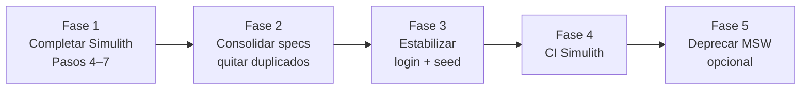

# Plan E2E — Simulith como fuente de verdad y deprecación gradual de MSW

Documento maestro para migrar la suite Cypress a **Simulith local** como gate principal, completar specs pendientes y **reducir MSW** sin perder feedback rápido donde aún aporte.

**Relacionado:** [GUIA-E2E-SIMULITH.md](./GUIA-E2E-SIMULITH.md) · [E2E-SIMULITH-BACKLOG.md](./E2E-SIMULITH-BACKLOG.md) · [SEED_SIMULITH.md](../../../loyalty-program-serverless/docs/infrastructure/SEED_SIMULITH.md)

---

## 1. Principios

| Principio | Implicación |
| --- | --- |
| **Simulith = contrato real** | Cognito, Lambda, DynamoDB, seed y SPA en `:4567` validan lo que producción emula |
| **MSW = acelerador opcional** | No es segunda fuente de verdad; se mantiene solo mientras reduzca tiempo de feedback |
| **Un spec, dos backends solo si hace falta** | Evitar duplicar bloques (`describeWhenMsw` + `describeWhenSimulith`); preferir helpers + fixtures |
| **Datos disposable en mutaciones** | No desactivar usuarios/oficinas bootstrap (`tenant.admin@…`, `Comfama Centro`) |
| **Clasificar antes de parchear** | Todo fallo Simulith → owner en [E2E-SIMULITH-BACKLOG.md](./E2E-SIMULITH-BACKLOG.md) |

---

## 2. Estado actual (2026-09-23)

### Specs Cypress (`cypress/e2e/`)

| Spec | Simulith | MSW | Notas |
| --- | --- | --- | --- |
| `login.cy.ts` | ✅ 8 tests Cognito | 2 legacy skipped | Dual `describeWhen*` |
| `rules.cy.ts` | ✅ 11/11 | Login dual vía commands | Sin bloques MSW duplicados |
| `program-administration.cy.ts` | ✅ ~25 activos | 7 duplicados `describeWhenMsw` | Paso 3b; deuda de duplicación |
| `accumulation.cy.ts` | ✅ 4/4 | ✅ default | Doc `10000003`, valor `5000` |
| `redemption.cy.ts` | ✅ 5/5 | ✅ default | OTP dinámico vía DynamoDB task |
| `transaction-history.cy.ts` | ✅ 9/9 (+1 MSW) | ✅ default | Doc `10000003`, txs reales de income/redemption |
| `user.cy.ts` | ✅ 5/5 | ✅ default | Login Cognito `customer@loyaleasy.test`, doc `10000003` |
| `auth-flows.cy.ts` | ❌ omitido | ✅ solo MSW | Registro / forgot / reset mock |

### Infra E2E Simulith

- **Run suite:** `npm run cy:e2e:run:simulith` (7 specs, sin `auth-flows`)
- **Pre-requisitos:** Simulith `:4567`, seed, bootstrap users, SPA desplegada, hosts `dev.loyaleasy.com`
- **CI GitHub:** solo `deploy.yml`; **no hay job E2E Simulith aún**

### MSW en el repo

- Activación: `VITE_USE_MSW=true` (`cy:dev`, `cy:e2e:run`)
- Handlers: `src/mocks/handlers/` (auth, program, rules, transaction, otp)
- Commands Cypress: login mock vía `localStorage` si `BACKEND !== simulith`

---

## 3. Fases del plan

---

## Fase 1 — Completar migración Simulith (Pasos 4–7)

**Objetivo:** suite `cy:e2e:run:simulith` verde en los 7 specs incluidos.

**Patrón por spec** (igual que Pasos 1–3):

1. Correr spec aislado: `npm run cy:e2e:run:simulith:<spec>` (añadir script si falta)
2. Registrar fallos en backlog con owner
3. Alinear **seed** (`loyalty-program-serverless`) o **fixture** (`cypress/fixtures/simulith-*.json`)
4. Refactor spec: `get*E2EData()`, helpers en `cypress/support/`, datos vía fixture si `isSimulithBackend()`
5. Validar corrida completa

| Paso | Spec | Riesgos conocidos | Acciones seed/fixture |
| --- | --- | --- | --- |
| **4** | `accumulation.cy.ts` | Doc `12345678` en spec; customer seed `10000003` | Decidir doc cliente con puntos/cuenta en DynamoDB; actualizar `simulith-e2e-data.json` |
| **5** | `redemption.cy.ts` | OTP `123456`, doc `1#12345678` en `otp.json` | Verificar par OTP/doc en seed; flujo expense + OTP Simulith |
| **6** | `transaction-history.cy.ts` | Historial vacío sin transacciones | Seed transacciones o income previo en `before()` |
| **7** | `user.cy.ts` | Customer `customer@loyaleasy.test` | Fixture `simulith-users.json`; datos historial/puntos |

**Criterio de salida Fase 1:** `npm run cy:e2e:run:simulith` → 0 failing (re-run aceptable por flake Cognito documentado).

---

## Fase 2 — Consolidar specs (eliminar duplicación MSW/Simulith)

**Objetivo:** un solo camino de tests por comportamiento; MSW solo donde no exista equivalente Simulith.

| Tarea | Archivos | Acción |
| --- | --- | --- |
| 2.1 | `program-administration.cy.ts` | Eliminar bloques `describeWhenMsw` de mutaciones (7 tests) cuando Simulith sea estable 3+ corridas |
| 2.2 | `login.cy.ts` | Eliminar `describeWhenMsw` legacy cuando nadie use `cy:e2e:run` para login |
| 2.3 | Specs 4–7 | Usar fixtures + helpers desde el inicio (no hardcode MSW) |
| 2.4 | `cypress/support/` | Extraer helpers comunes (`accumulation.ts`, `redemption.ts`, …) como `programAdministration.ts` |
| 2.5 | `simulith-e2e-data.json` | Fuente única de IDs/docs; comentario apuntando a archivos seed |

**Criterio de salida Fase 2:** ningún spec tiene pares duplicados MSW/Simulith para el mismo comportamiento.

---

## Fase 3 — Estabilidad y operación

**Objetivo:** reducir flake y coste de mantenimiento del entorno local.

| Tarea | Descripción |
| --- | --- |
| 3.1 **Login Cognito** | Investigar reutilizar sesión (`cy.session`) para no hacer login UI en cada `beforeEach` |
| 3.2 **Re-seed documentado** | Checklist en README E2E: cuándo ejecutar `seed-simulith.sh` + `bootstrap-test-users-simulith.sh` |
| 3.3 **Datos E2E aislados** | Tenant/oficinas disposable; no mutar bootstrap en tests de lectura |
| 3.4 **Scripts por spec** | Paridad: `cy:e2e:run:simulith:accumulation`, `:redemption`, etc. |
| 3.5 **Tiempo de suite** | Meta: suite completa &lt; 15 min con session cache (baseline actual ~45–60 min sin optimizar) |

**Criterio de salida Fase 3:** 3 corridas consecutivas de suite completa con ≤ 1 flake/login re-run.

---

## Fase 4 — CI (Simulith en pipeline)

**Objetivo:** gate automático pre-merge (o nightly) contra Simulith.

| Tarea | Notas |
| --- | --- |
| 4.1 | Workflow `.github/workflows/e2e-simulith.yml` (o job en existente) |
| 4.2 | Runner con Docker + Simulith; cache de imágenes si aplica |
| 4.3 | Secuencia: health → seed → bootstrap → deploy SPA (artifact) → `cy:e2e:run:simulith` |
| 4.4 | Publicar artefactos: screenshots Cypress, enlace a backlog en fallo |
| 4.5 | **No** bloquear PR hasta Fase 1 verde localmente de forma consistente |

**Criterio de salida Fase 4:** CI verde en `master` con suite Simulith completa.

---

## Fase 5 — Deprecación MSW (opcional, post Fase 4)

**Objetivo:** MSW solo si el equipo lo usa semanalmente; si no, eliminar para dejar de mantener handlers duplicados.

### Qué retener (mínimo viable MSW)

| Componente | Retener si… | Eliminar si… |
| --- | --- | --- |
| `cy:e2e:run` | Dev frontend sin Simulith levantado | CI solo Simulith + dev siempre con Docker |
| `auth-flows.cy.ts` | Registro/forgot no probados en Simulith | Flujos migrados o descoped |
| `src/mocks/handlers/*` | Unit/E2E MSW activos | Solo Simulith + mocks Jest en servicios |
| `describeWhenMsw` | Aún hay specs solo mock | Todos los specs pasan en Simulith |

### Orden de eliminación sugerido

1. Bloques `describeWhenMsw` duplicados en `program-administration.cy.ts`
2. Scripts `cy:e2e:run:real` si Simulith cubre lo mismo
3. Handlers no usados por Jest ni E2E
4. `VITE_USE_MSW` y `cy:dev` — **último paso**, tras consenso del equipo

### Qué **no** eliminar con MSW

- **Jest unit tests** que mockean servicios directamente (no dependen de MSW worker)
- **Fixtures JSON** en `src/mocks/data/` si los usan tests unitarios

**Criterio de salida Fase 5:** documentación y scripts reflejan Simulith como único E2E; MSW removido o limitado a `auth-flows` explícitamente.

---

## 4. Decisión: auth-flows

| Opción | Pros | Contras |
| --- | --- | --- |
| **A. Mantener solo MSW** | Rápido; no requiere Cognito registro real | Drift; omitido en gate Simulith |
| **B. Migrar a Simulith** | Un solo gate | Cognito + Lambdas post-confirmation; más trabajo |
| **C. Descoped E2E** | Menos mantenimiento | Sin cobertura automática de registro |

**Recomendación:** **A hasta Fase 4**; revisar **B** solo si registro es crítico en producto.

**Actualización 2026-09-24:** Simulith (≥0.209.0, pin **0.216.0** en `.simulith.env`) implementa Cognito self-service y flujos usados en Loyaleasy. Tras smoke manual en `:4567`, reabrir **opción B** para `auth-flows.cy.ts` (registro en [E2E-SIMULITH-BACKLOG.md](./E2E-SIMULITH-BACKLOG.md)).

---

## 5. Matriz de comandos (objetivo final)

| Uso | Comando | Cuándo |
| --- | --- | --- |
| Gate integración | `npm run cy:e2e:run:simulith` | Pre-merge, CI, validación contrato |
| Spec aislado | `npm run cy:e2e:run:simulith:<spec>` | Desarrollo iterativo |
| Regresión UI rápida (opcional) | `npm run cy:e2e:run` | Sin Docker; solo UI + MSW |
| Auth flows mock | `npm run cy:e2e:run -- --spec cypress/e2e/auth-flows.cy.ts` | Hasta decisión §4 |

---

## 6. Roles y artefactos

| Artefacto | Repo | Responsable |
| --- | --- | --- |
| Seed DynamoDB | `loyalty-program-serverless/infrastructure/dynamodb/` | Backend / quien extienda E2E |
| Bootstrap Cognito | `bootstrap-test-users-simulith.sh` | Backend |
| Fixtures Cypress | `cypress/fixtures/simulith-*.json` | Frontend E2E |
| Helpers | `cypress/support/*.ts` | Frontend E2E |
| Backlog fallos | `docs/testing/E2E-SIMULITH-BACKLOG.md` | Quien ejecute Simulith |
| Este plan | `docs/testing/PLAN-E2E-SIMULITH-MSW.md` | Actualizar al cerrar cada fase |

---

## 7. Checklist inmediato (siguiente sprint)

- [ ] **Paso 4** — `accumulation.cy.ts` contra Simulith
- [ ] **Paso 5** — `redemption.cy.ts`
- [ ] **Paso 6** — `transaction-history.cy.ts`
- [ ] **Paso 7** — `user.cy.ts`
- [ ] Suite completa verde local
- [ ] Actualizar backlog y marcar fases en este doc
- [ ] (Opcional) PoC `cy.session` en `login.cy.ts`
- [ ] (Post suite verde) Planificar Fase 4 CI

---

## 8. Riesgos

| Riesgo | Mitigación |
| --- | --- |
| Login Cognito flaky | `cy.session`; re-run documentado; no fallar CI sin retry |
| Suite lenta | Session cache; specs por job en CI paralelo |
| Drift seed ↔ fixtures | Comentarios en JSON + tabla en SEED_SIMULITH |
| Contaminación DynamoDB | Datos disposable; re-seed periódico |
| Doble mantenimiento MSW+seed | Fase 2 y 5 — eliminar duplicados |
| MSW eliminado demasiado pronto | Fase 5 solo tras CI Simulith estable |

---

## 9. Historial de fases

| Fase | Estado | Fecha | Notas |
| --- | --- | --- | --- |
| Pasos 1–3 (login, rules, program-admin) | ✅ Hecho | 2026-03-23 | Ver backlog |
| Paso 3b (mutaciones program-admin Simulith) | ✅ Hecho | 2026-03-23 | 25 tests Simulith |
| Fase 1 — Paso 4 (`accumulation.cy.ts`) | 🟡 Parcial | 2026-03-23 | Spec/fixture OK; 502 income → PostgreSQL |
| Fase 1 (Pasos 5–7) | ⏳ Pendiente | — | |
| Fase 2 (consolidar specs) | ⏳ Pendiente | — | |
| Fase 3 (estabilidad) | ⏳ Pendiente | — | |
| Fase 4 (CI) | ⏳ Pendiente | — | |
| Fase 5 (deprecar MSW) | ⏳ Pendiente | — | Opcional |

Actualiza la tabla al cerrar cada fase.
